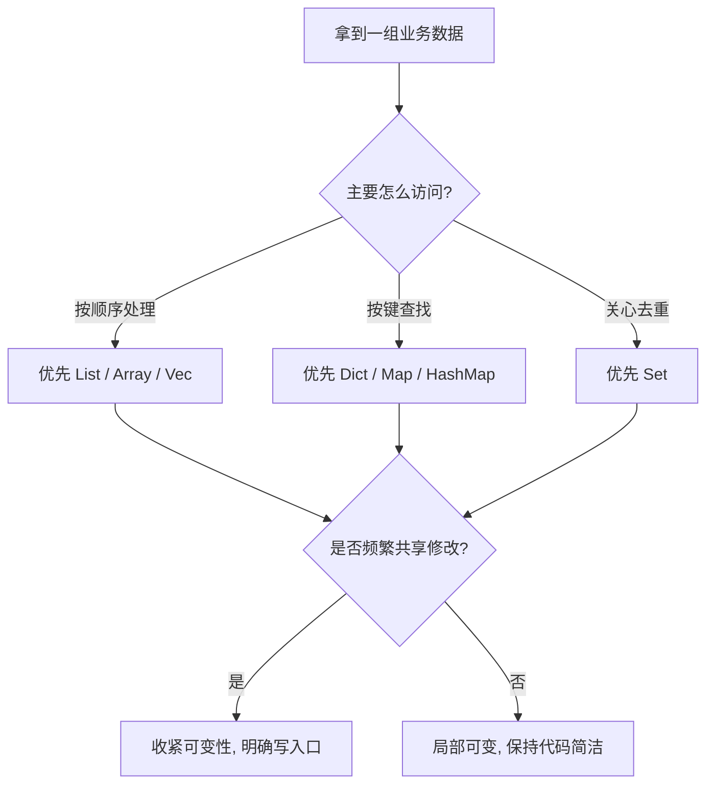

# 第二章：数据的容器（集合与结构）

## 先从切语言时最真实的困惑开始

很多人第一次横向切语言，会在容器这里突然不顺手。

在 Python 里，`list`、`dict` 用得很顺；
到了 Java，发现到处是 `List`、`Map`、泛型和接口；
到了 Rust，又多了 `Vec`、`HashMap`、借用和所有权；
到了 Swift、Kotlin，又会听到“尽量不可变”。

表面看，像是在换 API；
实际上，你换的是一整套“如何表达关系、如何控制修改、如何预防 bug”的思路。

这一章要做的，不是替你背一遍容器名字，而是帮你建立一个稳定判断：
**面对任何语言的容器，先看它鼓励你怎样组织关系，再看它允许你怎样修改关系。**

## 先讲人话

容器不是“拿来装数据的箱子”，而是程序对现实关系的压缩表达。

- 你用数组或列表，是在说“顺序重要”
- 你用映射，是在说“按键查找重要”
- 你用集合，是在说“唯一性重要”
- 你坚持不可变，是在说“关系一旦形成，不希望别人偷偷改掉”

所以容器选型从来不只是性能题，也是协作题、维护题和故障题。

## 本章在“现实抽象链”中的位置

这一章处理抽象链第二环：**类型模型 -> 关系结构**。

第一章解决“一个对象长什么样”；
第二章解决“多个对象之间怎样放在一起，怎样被访问，怎样被修改”。

如果说类型在回答“这是什么”，那么容器就在回答“它和谁在一起，以及怎么被找到”。

---

## 1. 容器到底在替你回答什么问题

写业务代码时，容器通常在替你回答四个问题：

| 问题 | 常见答案 | 对应容器倾向 |
| --- | --- | --- |
| 顺序是否重要？ | 重要 / 不重要 | List、Array、Vec |
| 是否要按键快速定位？ | 要 | Dict、Map、HashMap |
| 是否要保证不重复？ | 要 | Set |
| 是否允许被多人修改？ | 尽量不要 / 可以 | 不可变视图、可变容器 |

你可以把容器理解成一种“访问承诺”：

- 选择列表，是承诺以后主要按顺序读
- 选择映射，是承诺以后主要按键找
- 选择集合，是承诺以后主要做成员判断和去重

一旦这个承诺错了，后面的代码就会越来越别扭。

---

## 2. 同一业务题：统计已支付订单总额（按用户分组）

> 输入：`orders`（包含 `userId`、`amount`、`paid`）
> 输出：`totals[userId] = paidTotal`

这个例子很适合做横向比较，因为它同时暴露四件事：

1. 如何遍历序列
2. 如何判断条件
3. 如何更新映射中的累计值
4. 语言如何处理“键不存在”

### Python

```python
totals = {}
for o in orders:
    if o["paid"]:
        totals[o["userId"]] = totals.get(o["userId"], 0.0) + o["amount"]
```

### JavaScript

```javascript
const totals = new Map();
for (const o of orders) {
  if (!o.paid) continue;
  totals.set(o.userId, (totals.get(o.userId) ?? 0) + o.amount);
}
```

### Java

```java
Map<String, Double> totals = new HashMap<>();
for (Order o : orders) {
    if (!o.paid()) continue;
    totals.merge(o.userId(), o.amount(), Double::sum);
}
```

### C++

```cpp
std::unordered_map<std::string, double> totals;
for (const auto& o : orders) {
    if (!o.paid) continue;
    totals[o.user_id] += o.amount;
}
```

### Rust

```rust
use std::collections::HashMap;

let mut totals: HashMap<String, f64> = HashMap::new();
for o in &orders {
    if !o.paid {
        continue;
    }
    *totals.entry(o.user_id.clone()).or_insert(0.0) += o.amount;
}
```

### Go

```go
totals := map[string]float64{}
for _, o := range orders {
    if !o.Paid {
        continue
    }
    totals[o.UserID] += o.Amount
}
```

### Swift

```swift
var totals: [String: Double] = [:]
for o in orders where o.paid {
    totals[o.userId, default: 0.0] += o.amount
}
```

### Kotlin

```kotlin
val totals = mutableMapOf<String, Double>()
for (o in orders) {
    if (!o.paid) continue
    totals[o.userId] = (totals[o.userId] ?: 0.0) + o.amount
}
```

---

## 3. 读这组代码时，真正要看的不是语法

第一次横向对照时，很容易盯着“哪个写法短”。
但更有价值的观察是下面四件事。

### 3.1 “键不存在”时，语言如何帮你补位

- Python 用 `get`
- JavaScript 用 `Map#get` 加 `??`
- Java 用 `merge`
- Rust 用 `entry(...).or_insert(...)`
- Swift 用带默认值的下标
- Go 直接累加零值

这暴露的是语言对“缺省值”处理的态度：

- 有的强调方便，默认帮你兜住
- 有的强调显式，逼你承认“这个键可能还不存在”

### 3.2 可变性是默认还是被克制

- Python、JavaScript、Go 的容器默认就很容易改
- Java 倾向先给你接口类型，再决定背后实现
- Kotlin、Swift 更鼓励你先想“能不能不改”
- Rust 不是鼓励不改，而是要求你明确谁能改

这会直接影响团队合作的感受：

- 默认可变，写起来快，排查共享状态 bug 也快出现
- 默认克制，初写慢一点，系统长大后更稳

### 3.3 容器背后藏着“失败方式”

容器的问题往往不是“功能不够”，而是“失败得很隐蔽”。

例如：

- 用列表存本该按键访问的数据，代码会逐渐堆满线性查找
- 用字典存本该有顺序意义的数据，后续展示和对账会变乱
- 在并发场景共享可变映射，结果不是错得明显，而是偶发错

### 3.4 API 风格就是语言价值观

| 语言 | 你最容易感受到的容器气质 |
| --- | --- |
| Python | 快速直给，先把业务写出来 |
| JavaScript | 和对象、数据流操作粘得很近 |
| Java | 明确、稳定、适合长期维护 |
| C++ | 可以非常强，但代价你自己管 |
| Rust | 安全规则会渗进每一次容器操作 |
| Go | 朴素直接，避免“看不懂的巧妙” |
| Swift | 安全、值语义、API 体验讲究 |
| Kotlin | 想让你默认写出更整洁的集合代码 |

---

## 4. 迁移提醒：换语言时，容器心智要跟着换

### 从 Python / JavaScript 切到 Java / Kotlin

你最需要适应的，不是泛型语法，而是“接口优先”和“类型先行”。

以前你可能先把数据放进去再说；
现在你最好先想清楚：

- 键和值到底是什么类型
- 这份集合是否真的需要可变
- API 要暴露实现，还是只暴露能力

### 从 Java 切到 Go

你会觉得 Go 的容器“简单得有点过头”。
这不是能力弱，而是故意减少抽象层级。

Go 的风格是：

- 先给最常用的 map / slice
- 不急着给太多高级集合工具
- 通过简单约定保持团队一致性

### 从 Java / Go 切到 Rust

Rust 最难的不是记住 `Vec` 和 `HashMap`，而是接受：
**一次修改容器，可能牵动借用关系。**

这听起来麻烦，但它逼你提前想清楚：

- 谁持有数据
- 谁在读
- 谁在写
- 修改是否会影响别处引用

### 从 JVM 语言切到 Swift

Swift 的重要变化不是容器名字，而是值语义和 Copy-on-Write 心智。
很多时候你看起来像在复制，其实性能并没有你想象中那么差；
但这背后换来的是更可预测的共享行为。

---

## 5. 常见误区

### 误区一：先选自己最熟的容器

这是最常见也最危险的习惯。
你熟悉 `list`，不代表这个场景就该是列表。

真正应该先问的是：
“后续代码主要怎么访问它？”

### 误区二：把 Map 当万能容器

Map 很强，但也最容易把领域结构压扁。

如果一个对象本来有明确字段和行为，
用 `Map<String, Any>` 或对象字面量硬装进去，
短期很快，长期会失去边界、失去提示、失去重构能力。

### 误区三：忽略键的语义

容器 bug 很多时候不是值错，而是键错。

例如：

- 本该用业务唯一 id，却用了展示名称
- 键的大小写、空白、格式没有统一
- 自定义对象做 key，却没有稳定等价规则

### 误区四：只看均摊复杂度，不看真实读写路径

面试里会背 `O(1)`、`O(n)`，不等于工程里就会选对。

真实系统里，你还要考虑：

- 数据量到底有多大
- 是否频繁扩容
- 是否跨线程共享
- 是否需要稳定顺序
- 是否需要序列化和传输

---

## 6. 什么时候该偏向哪类语言的容器风格

| 场景 | 更容易顺手的语言风格 | 原因 |
| --- | --- | --- |
| 原型验证、脚本处理、数据清洗 | Python / JavaScript | 容器表达快，业务尝试成本低 |
| 长期维护的业务系统 | Java / Kotlin | 类型边界更稳，协作成本更可控 |
| 高性能与细粒度控制 | C++ / Rust | 容器行为和成本更可控 |
| 并发服务与工程统一性 | Go | 核心容器简单，团队心智容易统一 |
| Apple 生态应用开发 | Swift | 值语义和 API 设计有助于减少共享状态问题 |

这里要强调一句：
不是某门语言“容器最好”，而是它把复杂性放在了不同位置。

- 动态语言把复杂性更多放在后期约束
- 静态语言把复杂性更多放在前期建模
- Rust 把复杂性更多放在编译期关系校验

---

## 7. 一个实用判断法：先问访问模式，再定容器



这张图看起来简单，但非常适合代码评审。
很多容器争论，只要把“主要访问方式”说清楚，结论就会自然浮现。

---

## 8. 工程落地建议

- 在设计接口时，优先暴露“需要什么能力”，而不是“底层用什么容器”
- 默认先想不可变视图，再决定哪里允许修改
- 关键路径的容器选型，至少写出访问模式和复杂度理由
- 不要用“大家都这么写”替代真实场景分析
- 一旦出现共享可变容器，立刻补充所有权、锁或快照策略

## 回到贯穿主线：语言如何抽象现实

现实世界里的“用户-订单-商品”关系，进入程序后不只是数据堆放，
而是被翻译成“顺序”“索引”“唯一性”“修改权限”。

容器设计的差异，表面是 API 差异，
本质是各门语言在回答同一个问题：
**关系应该被表达得多自由，又应该被约束得多严格。**

---

## 本章小结

真正会横向迁移的人，看容器不会只记名字。

他会先问四件事：

1. 主要访问方式是什么
2. 是否允许共享修改
3. 缺省值和不存在怎么处理
4. 这门语言希望我把复杂性放在前面还是后面

把这四件事看明白，换语言时你就不会只剩“语法不顺手”，
而能很快抓住容器背后的工程逻辑。
