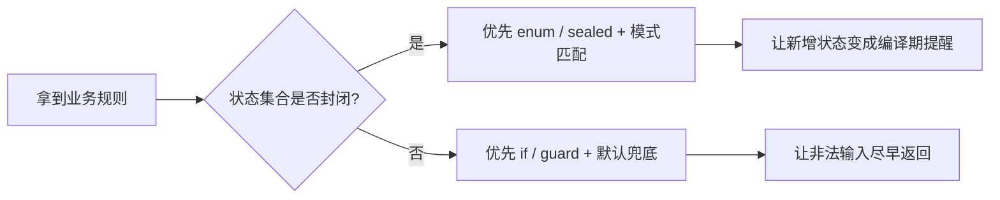

# 第三章：逻辑的流转（控制流）

## 先从切语言时最真实的困惑开始

很多人换语言时，最早感到不适的，不是变量，也不是容器，而是“怎么写分支才像这门语言”。

在 Python 里，你习惯一路 `if` 下去；
在 Go 里，大家推崇早返回；
在 Rust、Swift、Kotlin 里，你会明显感到模式匹配更有存在感；
到了 JavaScript，又常常会在 `if`、`switch`、异步流程之间切换。

表面上看，这只是控制流写法不同；
实际上，语言是在借控制流告诉你：

- 业务规则是否应该被穷尽列出
- 非法输入是否应该先挡在门外
- 默认分支应不应该存在
- 变更发生时，谁来提醒你漏改了逻辑

所以控制流从来不只是“让程序跑起来”，而是“让业务决策被人看懂、被测试覆盖、被未来修改”。

## 先讲人话

控制流就是把“现实里的判断和步骤”翻译成程序里的路径。

现实里你会说：

- 如果用户没登录，就不要下单
- 如果库存不足，就先返回错误
- 如果支付成功，就更新状态
- 如果状态值超出约定范围，就记录异常

程序里的 `if`、`switch`、`match`、`when`，本质都是在做这件事。

写控制流最重要的，不是会多少种语法，
而是能不能把规则写得让下一个人一眼看出：

- 哪些情况被允许
- 哪些情况被拒绝
- 哪些情况你已经考虑完了
- 哪些情况只是临时兜底

## 本章在“现实抽象链”中的位置

这一章处理抽象链第三环：**关系结构 -> 决策流程**。

前两章解决了“对象是什么”“对象如何组织”；
这一章开始处理更动态的问题：
**同样的数据进入系统后，会沿着哪些条件和路径继续流动。**

---

## 1. 同一业务题：根据订单状态决定下一步动作

> 规则：
> - `PENDING_PAYMENT` -> `WAIT_PAY`
> - `PAID` -> `SHIP`
> - `CANCELLED` / `REFUNDED` -> `STOP`
> - 其他 -> `CHECK_MANUALLY`

这类题目很适合做横向比较，因为它能同时暴露两种完全不同的语言倾向：

- 有些语言更鼓励你“顺着条件写下去”
- 有些语言更鼓励你“把状态空间列完整”

### Python

```python
def next_action(status: str) -> str:
    if status == "PENDING_PAYMENT":
        return "WAIT_PAY"
    if status == "PAID":
        return "SHIP"
    if status in ("CANCELLED", "REFUNDED"):
        return "STOP"
    return "CHECK_MANUALLY"
```

### JavaScript

```javascript
function nextAction(status) {
  switch (status) {
    case "PENDING_PAYMENT":
      return "WAIT_PAY";
    case "PAID":
      return "SHIP";
    case "CANCELLED":
    case "REFUNDED":
      return "STOP";
    default:
      return "CHECK_MANUALLY";
  }
}
```

### Java

```java
static String nextAction(String status) {
    return switch (status) {
        case "PENDING_PAYMENT" -> "WAIT_PAY";
        case "PAID" -> "SHIP";
        case "CANCELLED", "REFUNDED" -> "STOP";
        default -> "CHECK_MANUALLY";
    };
}
```

### C++

```cpp
std::string next_action(const std::string& status) {
    if (status == "PENDING_PAYMENT") return "WAIT_PAY";
    if (status == "PAID") return "SHIP";
    if (status == "CANCELLED" || status == "REFUNDED") return "STOP";
    return "CHECK_MANUALLY";
}
```

### Rust

```rust
fn next_action(status: &str) -> &'static str {
    match status {
        "PENDING_PAYMENT" => "WAIT_PAY",
        "PAID" => "SHIP",
        "CANCELLED" | "REFUNDED" => "STOP",
        _ => "CHECK_MANUALLY",
    }
}
```

### Go

```go
func nextAction(status string) string {
    switch status {
    case "PENDING_PAYMENT":
        return "WAIT_PAY"
    case "PAID":
        return "SHIP"
    case "CANCELLED", "REFUNDED":
        return "STOP"
    default:
        return "CHECK_MANUALLY"
    }
}
```

### Swift

```swift
func nextAction(_ status: String) -> String {
    switch status {
    case "PENDING_PAYMENT":
        return "WAIT_PAY"
    case "PAID":
        return "SHIP"
    case "CANCELLED", "REFUNDED":
        return "STOP"
    default:
        return "CHECK_MANUALLY"
    }
}
```

### Kotlin

```kotlin
fun nextAction(status: String): String = when (status) {
    "PENDING_PAYMENT" -> "WAIT_PAY"
    "PAID" -> "SHIP"
    "CANCELLED", "REFUNDED" -> "STOP"
    else -> "CHECK_MANUALLY"
}
```

---

## 2. 读这组代码时，真正要看的是什么

### 2.1 是“开放世界”还是“封闭世界”

如果一个值可能无限扩展，比如第三方平台状态码、用户输入、外部事件，
那它更像开放世界，你通常需要默认分支。

如果一个值来自你自己定义的有限状态，例如：

- `Pending`
- `Paid`
- `Cancelled`
- `Refunded`

那它更像封闭世界，这时模式匹配的价值会急剧上升。

因为编译器可以替你做一件非常宝贵的事：
**新状态一加入，就提醒你所有没改完的地方。**

### 2.2 语言是在帮你省字，还是帮你补漏

- Python、Go 倾向于直白，把判断顺序写清楚
- Rust、Swift、Kotlin 更强调分支完整性和模式表达力
- Java 在现代语法里努力平衡“企业可维护性”和“写法简洁”
- JavaScript 更看重现实兼容性，因此同一件事常有多种历史写法

### 2.3 控制流本身也在传递设计意图

下面两种写法，功能可能一样，但意图完全不同。

差一点的写法：主逻辑被层层嵌套包住。

```text
if 合法:
  if 库存足够:
    if 支付方式可用:
      执行业务
```

更成熟的写法：先挡掉非法条件，再进入主路径。

```text
if 不合法: return
if 库存不足: return
if 支付方式不可用: return
执行主逻辑
```

后者的优势不是“看着更酷”，而是排查时更快，变更时更稳。

---

## 3. 早返回为什么是横向迁移时必须掌握的习惯

很多语言风格差异，表面是 API 差异，底层其实是“是否鼓励早返回”。

### 一个坏味道：主逻辑埋得太深

```python
def create_order(req):
    if req.user_id:
        if req.items:
            if req.stock_ok:
                return save(req)
    raise ValueError("invalid request")
```

### 更成熟的写法：先排除，再进入主路径

```python
def create_order(req):
    if not req.user_id:
        raise ValueError("missing user")
    if not req.items:
        raise ValueError("empty items")
    if not req.stock_ok:
        raise ValueError("stock not enough")
    return save(req)
```

这类写法在 Go 里尤其常见，在 Java、Kotlin、Swift、Rust 里也一样受欢迎。
原因很简单：

- 分支更平
- 失败路径更显眼
- 主逻辑不会被缩进淹没

对于横向学习者来说，这是很重要的迁移点：
**切换语言时，不要只抄语法，要把控制流的“组织方式”一起迁过去。**

---

## 4. 迁移提醒：切语言时，控制流心智怎么换

### 从 Python / JavaScript 切到 Rust / Swift / Kotlin

你最该培养的习惯，是主动问自己：

- 这个状态集合是封闭的吗
- 我能不能用枚举或 sealed 类型表达它
- 新状态加入时，我想不想让编译器强迫我补完所有分支

这会让你从“写出能跑的判断”升级成“写出可演进的判断”。

### 从 Java / Kotlin 切到 Go

你会发现 Go 的控制流没有太多花样。
这不是保守，而是刻意控制复杂度。

Go 鼓励：

- 短函数
- 早返回
- 明确错误路径
- 少写炫技式分支表达

### 从动态语言切到强约束语言

在动态语言里，你更容易接受“其他情况再说”；
到了 Rust、Swift、Kotlin，这种模糊空间会被明显压缩。

这不是麻烦你，而是在逼你尽早承认：

- 你是否真的列完了状态
- 你是否真的想好了默认值
- 你是否有资格使用兜底分支

---

## 5. 常见误区

### 误区一：把控制流理解成纯语法问题

真正麻烦的不是不会写 `switch`，
而是不知道规则是否被表达完整。

### 误区二：默认分支写得太轻率

`default`、`else` 很方便，但也最容易掩盖遗漏。

如果一个状态集合本应封闭，却还保留宽松兜底，
那新增状态时，系统往往不会第一时间暴露问题。

### 误区三：为了“高级感”滥用模式匹配

模式匹配很强，但不是每个 `if` 都要改写成花哨表达式。

判断标准很简单：

- 如果你在表达有限状态空间，模式匹配通常更好
- 如果你在处理开放输入和边界校验，守卫式返回通常更清楚

### 误区四：把嵌套当成严谨

很多初学者误以为层层嵌套显得更严密，
实际上它只会让主逻辑越来越难看见。

---

## 6. 什么时候该偏向哪类语言的控制流风格

| 场景 | 更占优势的语言风格 | 原因 |
| --- | --- | --- |
| 脚本、自动化、小型业务逻辑 | Python / Go | 直白、短平快、容易读 |
| 有明确状态机的业务系统 | Rust / Swift / Kotlin | 模式匹配和穷尽性更有价值 |
| 历史系统和长期维护代码 | Java / Kotlin | 表达明确，团队治理成熟 |
| 接近底层、性能敏感逻辑 | C++ / Rust | 控制路径和成本更可控 |
| Web 事件与异步状态协作 | JavaScript / TypeScript | 与事件循环和异步模型贴合 |

这里的重点不是“谁更高级”，而是：
**哪门语言更擅长让你的那类规则保持清楚。**

---

## 7. 一个实用判断法：先判断状态是否封闭



这张图非常适合在做代码评审时使用。
很多“这段逻辑怎么写更优雅”的争论，
其实只要先回答“这是封闭世界还是开放世界”，答案就清楚很多。

---

## 8. 工程落地建议

- 分支多于 3 个时，先写规则表，再写代码
- 默认优先早返回，减少无意义嵌套
- 对封闭状态优先使用 `enum`、`sealed`、`ADT` 一类建模
- 审查 `else` / `default` 的存在理由，不要把它当垃圾桶
- 重要决策路径必须能被单元测试逐分支覆盖

## 回到贯穿主线：语言如何抽象现实

现实中的判断往往含糊、例外多、边界不整齐。
语言通过控制流，把这种混乱压缩成若干条可读、可测、可维护的路径。

不同语言的差异，表面上是 `if`、`switch`、`match`、`when` 的差异；
本质上是它们对同一个问题的不同回答：
**业务规则应该更多依赖人脑记住，还是更多交给语言机制帮助兜住。**

---

## 本章小结

控制流写得好，不是因为你会更多语法，
而是因为你能让规则显式、让遗漏暴露、让主路径清楚。

对横向迁移者来说，真正值得带走的不是某个关键字，
而是这三个判断：

1. 这是封闭状态还是开放输入
2. 该不该用早返回把非法路径先切掉
3. 我是想让人来记住分支，还是让编译器帮我补漏
