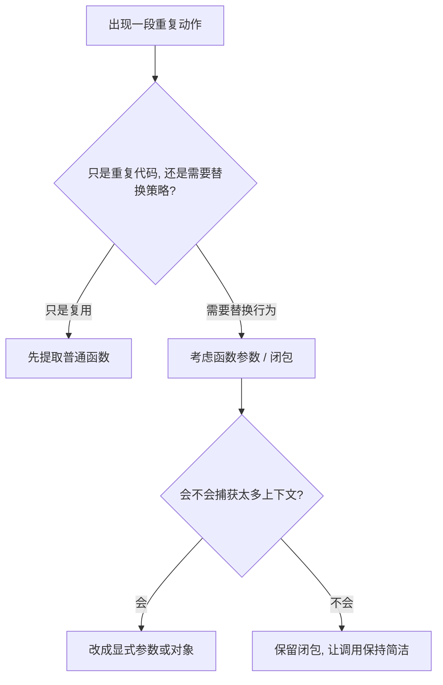

# 第四章：行为的封装（函数与闭包）

## 先从切语言时最真实的困惑开始

很多人横向切语言，到了函数和闭包这一章，会第一次感到“同样是函数，味道怎么差这么多”。

在 Python、JavaScript 里，把函数当参数传来传去很自然；
到了 Java，你突然要面对函数式接口；
到了 Rust，`Fn`、`FnMut`、`FnOnce` 又会让你怀疑自己是不是不只是学了一门新语法；
到了 Swift、Kotlin，你又会发现闭包几乎渗透进 UI、异步和 DSL。

这说明函数从来不只是“可调用的一段代码”。
它其实在替语言回答两个问题：

- 行为能不能像数据一样被传递
- 行为在传递时，能不能把上下文一起带走

这就是函数与闭包的核心。

## 先讲人话

你可以把函数想成“可复用的动作”，把闭包想成“带着小包袱一起移动的动作”。

- 普通函数：动作本身
- 闭包：动作 + 它偷偷带上的环境

例如“打九折”是动作；
“针对 VIP 用户打九折”就是带了上下文的动作。

一门语言对函数和闭包的支持方式，直接决定了它的 API 会长成什么样：

- 是写成一长串配置对象
- 还是写成高阶函数组合
- 是把策略作为参数传入
- 还是把行为封装进类和接口里

## 本章在“现实抽象链”中的位置

这一章处理抽象链第四环：**决策流程 -> 可复用行为单元**。

前面你已经有了数据和控制流；
现在的问题变成：
**哪些动作需要被提炼成能力，哪些上下文需要跟着动作一起移动。**

---

## 1. 同一任务：把折扣策略作为参数传进去

> 输入订单金额和折扣策略，输出最终金额。

这个例子很简单，但非常适合横向比较，因为它能直接暴露：

- 函数能不能当作一等公民
- 类型系统如何描述“一个可调用行为”
- 语言更习惯函数式风格还是对象式风格

### Python

```python
def checkout(amount: float, discount_fn):
    return discount_fn(amount)

print(checkout(200, lambda x: x * 0.9))
```

### JavaScript

```javascript
function checkout(amount, discountFn) {
  return discountFn(amount);
}

console.log(checkout(200, x => x * 0.9));
```

### Java

```java
static double checkout(double amount, java.util.function.DoubleUnaryOperator discount) {
    return discount.applyAsDouble(amount);
}
```

### C++

```cpp
double checkout(double amount, const std::function<double(double)>& discount) {
    return discount(amount);
}
```

### Rust

```rust
fn checkout<F>(amount: f64, discount: F) -> f64
where
    F: Fn(f64) -> f64,
{
    discount(amount)
}
```

### Go

```go
func checkout(amount float64, discount func(float64) float64) float64 {
    return discount(amount)
}
```

### Swift

```swift
func checkout(_ amount: Double, discount: (Double) -> Double) -> Double {
    discount(amount)
}
```

### Kotlin

```kotlin
fun checkout(amount: Double, discount: (Double) -> Double): Double = discount(amount)
```

---

## 2. 同一任务：闭包为什么不是“匿名函数”那么简单

如果你只把闭包理解成“没有名字的函数”，
你会错过它最重要的那一半：**捕获环境。**

下面这个计数器例子，重点不是匿名，而是“函数返回后，状态还跟着活着”。

### Python

```python
def make_counter():
    count = 0

    def inc():
        nonlocal count
        count += 1
        return count

    return inc
```

### JavaScript

```javascript
function makeCounter() {
  let count = 0;
  return () => ++count;
}
```

### Java

```java
AtomicInteger count = new AtomicInteger(0);
Supplier<Integer> inc = () -> count.incrementAndGet();
```

### C++

```cpp
auto make_counter() {
    int count = 0;
    return [count]() mutable { return ++count; };
}
```

### Rust

```rust
fn make_counter() -> impl FnMut() -> i32 {
    let mut count = 0;
    move || {
        count += 1;
        count
    }
}
```

### Go

```go
func makeCounter() func() int {
    count := 0
    return func() int {
        count++
        return count
    }
}
```

### Swift

```swift
func makeCounter() -> () -> Int {
    var count = 0
    return {
        count += 1
        return count
    }
}
```

### Kotlin

```kotlin
fun makeCounter(): () -> Int {
    var count = 0
    return {
        count += 1
        count
    }
}
```

---

## 3. 读这组代码时，真正要看的是什么

### 3.1 函数是不是“一等公民”

如果函数能被：

- 赋值给变量
- 当作参数传入
- 当作返回值交出去

那它就是一等公民。

Python、JavaScript、Go、Swift、Kotlin 在这一点上都很自然；
Java 和 C++ 也能做到，但表达方式带着更强的类型和历史背景；
Rust 能做到，而且还把调用能力分成了更精细的层级。

### 3.2 闭包真正难的不是语法，而是“捕获了什么”

闭包最常见的问题，不是写不出来，而是捕获得太随意。

比如：

- 不小心把整个大对象捕获进去
- 异步回调里抓住了过期状态
- 在移动端界面代码里形成循环引用
- 在 Rust 里因为所有权转移，后面代码突然不能再用原变量

所以看闭包时，一定别只看“参数列表”，还要看“它带走了谁”。

### 3.3 语言是在鼓励表达力，还是鼓励边界清楚

| 语言 | 你会明显感受到的函数风格 |
| --- | --- |
| Python | 快速组合，先把业务流串起来 |
| JavaScript | 回调、事件、异步天然靠近函数 |
| Java | 在 OOP 主轴上渐进吸收函数式能力 |
| C++ | 能非常强，但需要你理解更多细节 |
| Rust | 连闭包的调用方式都要讲清所有权语义 |
| Go | 给你函数能力，但不鼓励过度抽象 |
| Swift | 闭包和 API 设计深度结合 |
| Kotlin | 高阶函数和 DSL 让声明式写法非常自然 |

---

## 4. 迁移提醒：换语言时，函数心智怎么换

### 从 Java / C++ 切到 Python / JavaScript

你会感觉“行为突然变轻了”。
很多以前要靠接口、类、策略对象表达的东西，
现在直接传个函数就够了。

这会极大提高表达速度，但也容易让边界变松。
所以要补上的，不是语法，而是命名和约束纪律。

### 从 Python / JavaScript 切到 Java

你最需要适应的是：
**行为虽然也能传，但通常要借助更明确的类型名称。**

这会让代码稍微重一点，
但公共 API 的意图也会更稳定。

### 从动态语言切到 Rust

Rust 会逼你面对一个以前经常被忽略的问题：
这个闭包到底：

- 只是读取外部值
- 还是会修改它
- 还是会把它拿走

这就是 `Fn`、`FnMut`、`FnOnce` 背后的意义。
它们不是术语装饰，而是在精确描述行为和上下文的关系。

### 从后端语言切到 Swift / Kotlin

你会感受到闭包不再只是“业务策略”，
它还是 UI 交互、异步任务、构建 DSL 的核心部件。

这时需要特别注意：

- 生命周期
- 捕获范围
- 可读性
- 回调链是否过深

---

## 5. 常见误区

### 误区一：把闭包等同于“匿名函数”

匿名只是形式；
捕获上下文，才是闭包真正有力量、也真正有风险的地方。

### 误区二：为了灵活把一切都做成回调

高阶函数很好用，但不是所有地方都该塞一个“万能回调”。

如果一个 API 的行为边界不清楚，
再灵活的函数参数也只会把复杂性转移给调用方。

### 误区三：忽略捕获成本

闭包最隐蔽的问题不是它能不能跑，
而是它会不会把不该活这么久的对象也一起留住。

### 误区四：把函数式写法误当成更高级

写得更短，不等于写得更清楚。
尤其在团队代码里，高阶函数、链式调用、嵌套闭包一多，
读者很快就会失去主线。

---

## 6. 什么时候该偏向哪类语言的函数风格

| 场景 | 更占优势的语言风格 | 原因 |
| --- | --- | --- |
| 脚本、数据处理、快速拼装业务流 | Python / JavaScript | 一等函数上手快，组合轻 |
| 长期维护的企业代码 | Java / Kotlin | 高阶函数可用，但边界仍较明确 |
| 高性能和精细控制 | C++ / Rust | 行为抽象能力强，成本更可控 |
| 并发和服务端朴素工程 | Go | 有函数能力，但不过度魔法化 |
| UI 与声明式 API | Swift / Kotlin | 闭包和 DSL 非常自然 |

判断标准不要是“哪门语言更函数式”，
而要是：
**这个场景到底需要多少行为抽象，以及你愿意把多少复杂性放进调用关系里。**

---

## 7. 一个实用判断法：行为要不要被抽出来



这张图很好用，因为它提醒我们：
不是能用闭包就一定要用，
真正的判断标准是“边界是否仍然清楚”。

---

## 8. 工程落地建议

- 跨模块 API 优先先写清签名，再决定是否上高阶函数
- 闭包只捕获必要数据，不捕获整个上下文对象
- 异步闭包必须考虑取消、超时和生命周期
- 复杂链式调用一旦影响阅读，就主动拆回具名函数
- 做代码评审时，除了看参数，也要看闭包到底捕获了什么

## 回到贯穿主线：语言如何抽象现实

现实中的动作不会只发生一次。
一旦某个动作会重复、会变化、会被替换，
它就需要从“具体代码”上升成“可传递的能力”。

函数和闭包的差异，表面上是语法差异；
本质上是各门语言在回答同一个问题：
**行为应该多轻量地传递，又应该多严格地描述它和上下文之间的关系。**

---

## 本章小结

函数决定系统有没有组合能力；
闭包决定行为在跨边界移动时，会不会把状态一起带过去。

对横向迁移者来说，最重要的不是记住每门语言怎么写 lambda，
而是养成三个习惯：

1. 先判断这是普通复用，还是策略替换
2. 看闭包时一定追问“它捕获了什么”
3. 不要为了灵活牺牲边界清晰度
