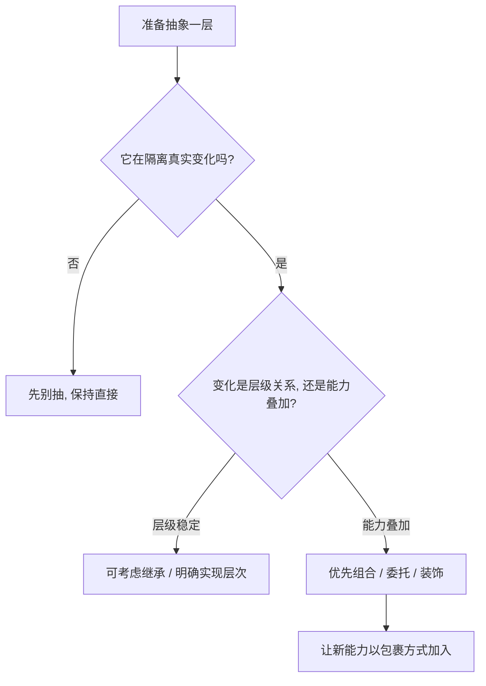

# 第五章：世界的抽象（面向对象与组合）

## 先从切语言时最真实的困惑开始

横向切语言时，很多人到了“抽象”这一章会突然乱掉。

在 Java 里，你很自然会想到接口、实现类、分层；
在 Go 里，接口却常常很小，甚至由使用方定义；
在 Rust 里，`trait` 更像能力集合；
在 Swift 里，大家会谈 protocol-oriented programming；
到了 Python 和 JavaScript，又会发现很多抽象是靠约定和组合自然长出来的。

这很容易让人误以为：
每门语言都在发明自己的那套抽象哲学。

其实没有那么复杂。
它们都在回答同一个老问题：
**系统会变化，那我应该把稳定的部分和会变化的部分切在哪里。**

## 先讲人话

抽象不是为了显得高级，而是为了让变化别一来就把代码全震碎。

你可以把抽象理解成两件事：

- 先给能力起名字
- 再决定能力是通过继承、接口、协议、trait，还是组合来组织

所谓“设计好不好”，不在于用了多少高级词，
而在于：

- 需求变了，改动是不是能局部收敛
- 新功能来了，是不是能插进去而不是砸进去
- 调试问题时，边界是不是清楚

## 本章在“现实抽象链”中的位置

这一章处理抽象链第五环：**行为单元 -> 系统组织方式**。

前一章我们把动作提炼成了函数和能力；
这一章我们开始问更大的问题：
**这些能力要怎样组织成可演进的系统。**

---

## 1. 同一任务：定义支付能力

> 目标：定义统一支付能力 `pay(amount)`，让不同支付方式都能接到同一个调用点上。

这是抽象最经典的起点。
我们并不关心它到底是微信、支付宝、信用卡，
我们先关心：
**有没有一种稳定能力，可以让上层代码只面对“支付”这件事。**

### Python

```python
from abc import ABC, abstractmethod

class Payment(ABC):
    @abstractmethod
    def pay(self, amount: float) -> None:
        pass
```

### JavaScript

```javascript
class Payment {
  pay(amount) {
    throw new Error("must implement pay");
  }
}
```

### Java

```java
public interface Payment {
    void pay(double amount);
}
```

### C++

```cpp
struct Payment {
    virtual ~Payment() = default;
    virtual void pay(double amount) = 0;
};
```

### Rust

```rust
trait Payment {
    fn pay(&self, amount: f64);
}
```

### Go

```go
type Payment interface {
    Pay(amount float64)
}
```

### Swift

```swift
protocol Payment {
    func pay(amount: Double)
}
```

### Kotlin

```kotlin
interface Payment {
    fun pay(amount: Double)
}
```

---

## 2. 抽象真正难的，不是“定义接口”，而是“应不应该叠层”

定义一个能力接口通常不难。
真正难的是第二步：

- 审计要不要单独叠一层
- 重试要不要单独叠一层
- 限流要不要单独叠一层
- 日志、监控、缓存到底靠继承还是靠组合

这时，“组合优于继承”才开始变成真实问题，而不是口号。

下面这个例子展示的，就是如何在不改原始支付实现的前提下，加上一层审计。

### Go（组合装饰）

```go
type AuditPayment struct {
    Next Payment
}

func (a AuditPayment) Pay(amount float64) {
    log.Printf("audit amount=%v", amount)
    a.Next.Pay(amount)
}
```

### Rust（trait 包装）

```rust
struct AuditPayment<T: Payment> {
    next: T,
}

impl<T: Payment> Payment for AuditPayment<T> {
    fn pay(&self, amount: f64) {
        println!("audit amount={amount}");
        self.next.pay(amount);
    }
}
```

### Kotlin（委托）

```kotlin
class AuditPayment(private val next: Payment) : Payment by next {
    override fun pay(amount: Double) {
        println("audit amount=$amount")
        next.pay(amount)
    }
}
```

这几种写法表面不同，但核心思想一样：
**不是改原对象，而是在外面再包一层能力。**

---

## 3. 读这组代码时，真正要看的是什么

### 3.1 抽象的单位是什么：类、接口，还是能力

很多人早期学 OOP，会下意识把抽象理解成“类层级”。
但现代工程里，更有价值的抽象单位往往是“能力边界”。

所以你会看到：

- Java 用接口把能力名字先定住
- Go 用小接口减少耦合
- Rust 用 trait 表达能力组合
- Swift 用 protocol 把能力和实现拆开
- Python / JavaScript 更多通过约定和组合来达成同样目的

### 3.2 好抽象不是更通用，而是更能隔离变化

抽象最常见的误区，是以为“越通用越高级”。
其实真正好的抽象，往往刚好够用。

一个抽象值不值得存在，要看它是否真的减少了某种变化成本：

- 新支付方式加入时，上层要不要改
- 审计逻辑加入时，原实现要不要动
- 测试替身接入时，边界是否清楚

如果答案都是否定的，那这个抽象多半是有价值的。

### 3.3 语言的抽象风格，就是它的工程价值观

| 语言 | 你会明显感受到的抽象风格 |
| --- | --- |
| Python | 先把协作关系跑通，再靠测试和规范守边界 |
| JavaScript | 组合和中间件文化很强，偏实战驱动 |
| Java | 接口、分层、依赖注入，强调长期治理 |
| C++ | 可以做得极细，但复杂度管理主要靠你自己 |
| Rust | 抽象要和零成本、静态安全一起成立 |
| Go | 小接口、少层级、按需抽象 |
| Swift | protocol 与值类型组合，强调安全和可维护 |
| Kotlin | 面向对象、函数式、委托混合得很务实 |

---

## 4. 迁移提醒：切语言时，抽象心智怎么换

### 从 Java 切到 Go

你最不适应的，通常不是语法，而是接口尺寸。

Java 里常见“先设计一组完整接口”；
Go 常常反过来：
**谁使用，谁定义自己真正需要的最小接口。**

这会让系统更松耦合，但也要求你克制“先搭大框架”的冲动。

### 从 OOP 浓重的语言切到 Rust / Swift

你会逐渐感受到：
抽象不一定非要靠继承树。
很多时候，用 trait、protocol、扩展、组合，就已经足够表达能力关系。

### 从 Python / JavaScript 切到强约束语言

你会发现“按约定就行”不再总是够用。
一些原来靠团队默契维持的边界，
在 Java、Rust、Swift、Kotlin 里更适合写进类型和接口里。

### 从强约束语言切回动态语言

要提醒自己：
没有编译器替你守边界时，
越是灵活，越要主动把抽象边界写清楚，
否则很快会退化成“大对象 + 大函数 + 大家都能改”。

---

## 5. 常见误区

### 误区一：一开始就设计完整抽象体系

这是最经典的过度设计来源。
系统还没长出来，抽象先搭了三层，
最后往往是概念很多，变化一来还是全得改。

### 误区二：把继承当默认复用手段

继承不是错，但它只适合关系稳定、语义明确的层级。

一旦你面对的是：

- 审计
- 重试
- 限流
- 缓存
- 监控

这类横切能力，组合通常比继承更稳。

### 误区三：接口太大

一个接口如果把实现者不一定需要的能力也塞进去，
它很快会变成耦合源。

大接口的后果通常是：

- 测试替身难写
- 实现类被迫空实现
- 调用方依赖了太多不该知道的细节

### 误区四：抽象和业务变化脱节

抽象不是凭想象长出来的。
真正好的抽象，通常来自你已经看见了某种变化反复出现。

---

## 6. 什么时候该偏向哪类语言的抽象风格

| 场景 | 更占优势的语言风格 | 原因 |
| --- | --- | --- |
| 快速演进、需求还在变化 | Python / JavaScript | 抽象可以长得更轻、更晚 |
| 长期维护的大型业务系统 | Java / Kotlin | 接口边界和治理模式成熟 |
| 高可靠底层系统 | Rust / C++ | 抽象必须和性能、安全一起成立 |
| 云服务与团队一致性 | Go | 小接口、组合、少层级更稳 |
| Apple 生态应用和框架设计 | Swift | protocol 和组合表达能力很强 |

这里不要理解成“某门语言更适合做架构”。
更准确的说法是：
**不同语言对抽象的默认姿势不同，你应该顺着它的强项组织系统，而不是硬搬另一门语言的习惯。**

---

## 7. 一个实用判断法：抽象是在隔离什么变化



这张图很好记：
先别问“能不能抽象”，先问“它在隔离哪种变化”。
没有变化，就没有抽象存在的必要。

---

## 8. 工程落地建议

- 只有当变化模式开始重复出现时，再抽象
- 默认组合优先，继承留给稳定层级关系
- 接口按消费者最小需求定义，不要一口气做大
- 每加一层抽象，都回答一句：它减少了哪类修改波及
- 如果一个抽象让调用方更难理解，它大概率还不成熟

## 回到贯穿主线：语言如何抽象现实

现实世界里的系统不会静止不变。
支付会增加渠道，日志会变成审计，接口会增加限流，业务会要求灰度和回滚。

抽象的任务，就是把这些变化隔离在合适边界内。
不同语言在接口、trait、protocol、组合上的差异，
表面是语言设计不同，
本质是它们在回答同一个问题：
**系统应该靠什么方式吸收变化，而不让变化扩散成全局震动。**

---

## 本章小结

抽象不是“看起来更优雅”的艺术，
而是“变化来时，系统还能稳住”的工程能力。

对横向迁移者来说，最重要的不是记住每门语言接口的写法，
而是记住这三个判断：

1. 我在抽象的，是稳定能力还是未来变化
2. 这层抽象是在减少改动波及，还是只是在制造概念
3. 这里更适合继承，还是更适合组合
