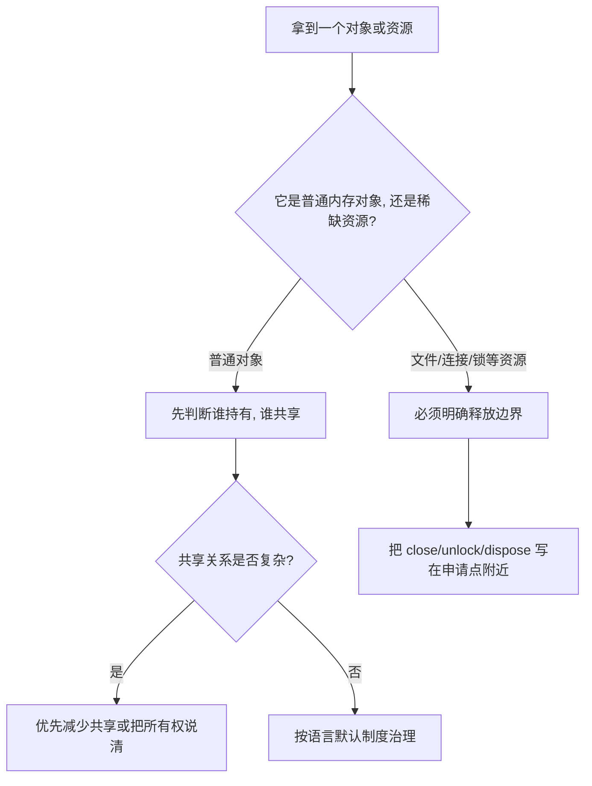

# 第六章：内存的哲学（生死与边界）

## 先从切语言时最真实的困惑开始

很多人在 GC 语言里写久了，会形成一种很自然的直觉：

- 对象用完了，系统迟早会收
- 文件读完了，库大概率会替我关
- 只要别写出特别离谱的大对象，内存问题离我很远

但一旦你切到 C++、Rust、Swift，这套直觉就会开始失灵。
语言会反过来追问你一些以前很少被追问的问题：

- 这个对象到底归谁拥有？
- 它可以被几个人同时拿着吗？
- 它什么时候必须结束生命，而不是“迟早会结束”？
- 这个闭包为什么把整棵对象树都留住了？

这就是为什么，内存问题往往是“会一门语言”和“能横向切多门语言”之间的一道分水岭。
语法还能靠肌肉记忆迁移，生命周期观念不行。

## 先讲人话

内存管理真正管理的，不是字节数，而是对象关系。

一个对象从创建到离场，至少要回答四个问题：

1. 谁创建了它？
2. 谁还在持有它？
3. 谁负责在合适的时候结束它？
4. 结束之后，谁还可能误用它？

你可以把不同语言的内存模型，理解成对这四个问题的不同制度回答：

- GC 语言说：大多数对象的善后交给运行时统一处理
- Go 说：对象可以交给 GC，但外部资源必须自己交代清楚
- ARC 语言说：最后一个强引用消失时，对象就该离场
- C++ 说：资源最好和作用域绑定在一起
- Rust 说：如果所有权关系说不清，那就先别编译通过

所以，内存问题从来不只是性能问题。
它首先是边界问题，其次才是速度问题。

## 本章在“现实抽象链”中的位置

这一章处理抽象链第六环：**对象模型 -> 生命周期治理**。

前几章解决的是“对象是什么、关系如何组织、行为怎样复用”；
到了这里，问题变成了：
**对象活多久、谁能碰它、谁要为它的善后负责。**

---

## 1. 在订单系统里，哪些东西最容易活得太久

真正的内存事故，往往不是教科书上的“忘记释放一块内存”那么简单。
更常见的是下面这些工程现场：

- 订单导出任务已经结束了，但文件句柄和缓冲区还挂着
- 一个本该只活在请求里的 `OrderDetail`，被缓存和闭包一起留到了下一个小时
- iOS 订单页已经返回上一级了，ViewModel 却还因为闭包循环引用没有释放
- 一个共享订单缓存被多处引用，谁都说“应该不是我负责销毁”

这些问题看起来不一样，但本质上都在问同一个问题：
**对象关系到底是谁说了算。**

对横向迁移的读者来说，内存章最重要的不是背定义，
而是训练一种新习惯：
看到对象和资源时，先问“它会活多久”，再问“它怎么被用”。

---

## 2. 八语言同题：把已支付订单导出成 CSV，并确保文件句柄最终关闭

> 任务：把已支付订单导出到 `paid_orders.csv`。
> 重点不在 CSV 解析，而在“无论中途是否失败，文件句柄都要被正确关闭”。

### Python

```python
def export_paid_orders(orders, path: str) -> None:
    with open(path, "w", encoding="utf-8") as f:
        for order in orders:
            if not order.paid:
                continue
            f.write(f"{order.id},{order.amount}\n")
```

### JavaScript（Node.js）

```javascript
import { open } from "node:fs/promises";

async function exportPaidOrders(orders, path) {
  const handle = await open(path, "w");
  try {
    for (const order of orders) {
      if (!order.paid) continue;
      await handle.write(`${order.id},${order.amount}\n`);
    }
  } finally {
    await handle.close();
  }
}
```

### Java

```java
void exportPaidOrders(List<Order> orders, Path path) throws IOException {
    try (var writer = Files.newBufferedWriter(path)) {
        for (Order order : orders) {
            if (!order.paid()) continue;
            writer.write(order.id() + "," + order.amount());
            writer.newLine();
        }
    }
}
```

### C++

```cpp
void export_paid_orders(const std::vector<Order>& orders, const std::string& path) {
    std::ofstream out(path);
    if (!out) {
        throw std::runtime_error("open failed");
    }

    for (const auto& order : orders) {
        if (!order.paid) continue;
        out << order.id << "," << order.amount << "\n";
    }
}
```

### Rust

```rust
use std::fs::File;
use std::io::{BufWriter, Write};

fn export_paid_orders(orders: &[Order], path: &str) -> std::io::Result<()> {
    let file = File::create(path)?;
    let mut writer = BufWriter::new(file);

    for order in orders.iter().filter(|o| o.paid) {
        writeln!(writer, "{},{}", order.id, order.amount)?;
    }

    writer.flush()?;
    Ok(())
}
```

### Go

```go
func ExportPaidOrders(orders []Order, path string) error {
    f, err := os.Create(path)
    if err != nil {
        return err
    }
    defer f.Close()

    w := bufio.NewWriter(f)
    for _, order := range orders {
        if !order.Paid {
            continue
        }
        if _, err := fmt.Fprintf(w, "%s,%0.2f\n", order.ID, order.Amount); err != nil {
            return err
        }
    }
    return w.Flush()
}
```

### Swift

```swift
func exportPaidOrders(_ orders: [Order], to path: String) throws {
    FileManager.default.createFile(atPath: path, contents: nil)
    let handle = try FileHandle(forWritingTo: URL(fileURLWithPath: path))
    defer { try? handle.close() }

    for order in orders where order.paid {
        let line = "\(order.id),\(order.amount)\n"
        try handle.write(contentsOf: Data(line.utf8))
    }
}
```

### Kotlin

```kotlin
fun exportPaidOrders(orders: List<Order>, path: String) {
    java.io.File(path).bufferedWriter().use { writer ->
        orders.filter { it.paid }.forEach { order ->
            writer.write("${order.id},${order.amount}\n")
        }
    }
}
```

这 8 段代码表面都在做同一件事，但它们暗中回答的是不同的问题：

- 关闭文件是由语法块保障，还是由对象生命周期保障？
- 资源释放是否和作用域天然绑定？
- 开发者是默认可以先不想，还是必须明确写出来？

真正的差异，不在 `open` 还是 `FileHandle`，而在：
**语言要求你以什么方式承担后果。**

---

## 3. 读这组代码时，真正要看的是什么

### 3.1 释放时机是不是可预测

- Python、Java、Kotlin 常用 `with`、`try-with-resources`、`use` 把资源边界写成语法结构
- Go 用 `defer` 把善后动作放回申请点附近
- Swift 常见 `defer` + ARC 组合，既有自动内存管理，也要自己交代外部资源
- C++ 和 Rust 更依赖作用域结束时的析构或 drop

这里最重要的不是“哪种写法更短”，而是：
**你是否能一眼看出资源会在什么时候结束。**

### 3.2 语言区分“对象内存”和“外部资源”的力度有多强

很多跨语言迁移者最容易犯的错，是把“对象最终会被回收”和“资源会及时关闭”混为一谈。

但文件、数据库连接、锁、socket、HTTP body 不是普通对象。
对它们来说，“晚一点释放”有时就等于“系统已经出事”。

所以很多成熟语言都会给你一条明确信号：
**普通对象可以让运行时慢慢善后，稀缺资源不行。**

### 3.3 共享关系是否容易被看见

一个对象之所以会活太久，往往不是因为没人释放，而是因为还有地方在偷偷持有它。

例如：

- 一个订单详情被缓存又被闭包捕获
- 一个 view model 和 callback 互相引用
- 一个大对象被塞进全局 map 后再也没移出来

语言的差异，在这里会变得非常明显：

- GC 语言更容易让这些关系“先运行起来再说”
- Swift 会让你开始正视强弱引用
- Rust 会更早逼你说清借用和所有权
- C++ 会把资源边界和共享策略更直接地交回给你

### 3.4 复杂性被放在谁那里

| 制度 | 代表语言 | 复杂性主要放在哪 | 你换来的东西 | 你必须补上的意识 |
| --- | --- | --- | --- | --- |
| 运行时托管 | Python、JavaScript、Java、Kotlin | 运行时和 GC | 业务开发快，主流程干净 | 不要把“会回收”误解成“不会泄漏” |
| 运行时托管 + 显式资源边界 | Go | 运行时 + 开发者显式善后 | 代码直接，团队不容易忘事 | `defer`、`context`、逃逸成本要有感觉 |
| 引用计数 | Swift | 引用关系图 | 释放时机更可预测 | 循环引用是你的责任 |
| 作用域 / 所有权治理 | C++、Rust | 开发者或编译器前置建模 | 性能和可预测性更强 | 必须先把“谁拥有谁”想清楚 |

这里最容易出现的误解，是把它们理解成“谁更高级”。
其实不是。它们只是在不同场景下，对复杂性做了不同分摊。

---

## 4. 四种制度，四种工程气质

### 4.1 GC 阵营：先把业务写出来，释放细节交给运行时

Python、JavaScript、Java、Kotlin 的共同点，是尽量不让你在日常业务里频繁讨论对象何时销毁。

这非常适合：

- 需求多变、迭代快的业务系统
- 团队协作人数多、代码需要长期维护
- 大量精力更应该花在领域规则，而不是资源细节上

但它们并不是“没有内存问题”，只是把问题从“悬垂指针”换成了：

- 某个缓存一直持有旧对象
- 某个监听器没有解绑
- 某个闭包把整棵对象树一起捕获了
- 某段代码频繁分配，导致 GC 压力上升

也就是说，GC 消灭的是一类错误，不是全部错误。

### 4.2 Go：对象可以交给 GC，但外部资源必须自己交代

Go 很务实。它不要求你像 C++ 或 Rust 那样处处声明所有权，但也不会让你假装“资源结束”这个问题不存在。

所以 Go 的典型风格是：

- 内存里的普通对象，交给 GC
- 文件、socket、锁、response body 这类外部资源，显式 `Close` 或 `Unlock`
- 通过 `defer` 把善后动作紧贴申请点写出来

这让 Go 在服务端工程里非常顺手，因为它给人的不是“理论上最优”，而是“在忙乱的团队现场最不容易忘事”。

### 4.3 Swift：对象销毁更可预测，但引用关系必须想明白

Swift 的 ARC 很适合 UI 和移动端。原因很简单：
移动端很在意卡顿，也很在意对象什么时候离场。相比纯 GC，ARC 的释放时机通常更可预测。

但代价是，工程师必须开始看见“引用图”。

一个非常典型的 Swift 迁移瞬间是：
你不是忘了释放对象，而是 `self` 和闭包互相抓住了，谁也下不来。

所以在 Swift 里，很多内存问题不是“没 free”，而是“强引用关系设计错了”。

### 4.4 C++ 与 Rust：把生命周期变成一等问题

C++ 和 Rust 的共同点，是都不愿意把资源治理完全托付给一个不可见的运行时。

但两者解决方式不同：

- C++ 主要靠 RAII、作用域、析构函数、智能指针，把资源绑定到对象生命周期
- Rust 进一步把“谁拥有谁、谁能借用多久”前置到类型系统和编译器里

这就是为什么很多人初学 Rust 会有一种被“语言审问”的感觉。
其实编译器问的都不是多余问题，它只是把你过去在线上或 code review 里才会补问的问题，提前到了写代码的那一刻。

---

## 5. 迁移提醒：从一种制度切到另一种制度，旧直觉最容易害人

### 从 GC 语言切到 C++ / Rust

你要停止默认这几件事：

- 停止默认“对象先传着，之后总会有人收拾”
- 停止默认“复制一下问题不大”
- 停止默认“先写通，再慢慢优化生命周期”

你要开始主动问：

- 这个值应该被移动、借用，还是共享？
- 这个资源是逻辑对象，还是稀缺资源？
- 当前这次 `clone` 或 `shared_ptr`，是在表达真实关系，还是只是在绕过约束？

### 从 C++ / Rust 切到 Go / Java / Python

你要放下的，是“凡事先精打细算每个对象的生死”。

在这些语言里，更重要的是：

- 先保证接口清晰、代码稳定、可观测
- 再看是否真的需要为某条热点路径做分配优化
- 注意对象是否被容器、闭包、全局状态长期持有

也就是说，迁移后的重点从“避免悬垂”变成了“避免无意保留”。

### 从 Java / Go 切到 Swift

你会以为自己已经熟悉自动内存管理，但 ARC 和 GC 的思维并不相同。

最关键的变化是：

- GC 语言里，环通常最终能被处理
- ARC 里，环会让对象永久活着，除非你手动打断

所以，`weak`、`unowned`、闭包捕获列表，不是 Swift 的语法装饰，而是生命周期设计工具。

---

## 6. 常见坑：内存事故往往不是“不会释放”，而是“关系说不清”

### 坑一：以为 GC 语言就没有“内存泄漏”

GC 只能回收“不可达”的对象。
如果一个大对象还被缓存、定时器、listener、闭包引用着，它当然不会消失。

所以在 GC 语言里，“泄漏”常常表现为：

- 看似不用的对象仍然可达
- 一条链路把整棵对象树都挂住了
- 临时集合被偷偷变成了长期集合

### 坑二：把 `defer`、`finally`、`use` 当成可有可无的修饰

文件、数据库连接、锁、HTTP body 不是普通对象。
对这些资源来说，“晚一点释放”有时就等于“系统已经出事”。

一个非常经典的迁移错误是：
你相信 GC 会替你收尾，于是没有及时关闭文件和连接。结果不是内存先爆，而是句柄、连接池、fd 先出问题。

### 坑三：在 Rust 里用 `clone` 把一切问题都糊过去

`clone` 有时是正确表达，有时只是把生命周期问题转成了性能问题。
Rust 真正训练你的，不是“怎么让编译器闭嘴”，而是“怎么把数据关系讲清楚”。

### 坑四：在 C++ 里用 `shared_ptr` 解决所有共享问题

`shared_ptr` 很有用，但滥用以后，你只是从“悬垂风险”切到了“共享关系过度复杂、释放时机不透明、循环引用”这些新问题上。

---

## 7. 什么时候该偏向哪类语言：不要只问谁快，要问谁更适合承受这类复杂性

| 场景 | 更常见的合适选择 | 原因 |
| --- | --- | --- |
| 需求多变、业务规则复杂的后台系统 | Java、Kotlin、Go、Python | 团队沟通和可维护性通常比极致控制更重要 |
| 移动端 UI、对象图复杂且非常在意响应一致性 | Swift | 释放时机相对可预测，配合平台生态成熟 |
| 低延迟、高吞吐、资源受限的底层模块 | C++、Rust | 生命周期和资源控制更精细 |
| 强调正确性、希望把大量错误前置到编译期 | Rust | 早期建模更重，但后期稳定性收益高 |
| 已有大规模 JVM 体系、人才与工具成熟 | Java、Kotlin | GC、工具链、可观测和治理体系完整 |

真正成熟的选型，从来不是“这门语言最强”，而是：
**它把复杂性放的地方，是否正好是你的团队最能承受的地方。**

---

## 8. 一个实用判断法：先区分对象、资源和共享关系



这张图的价值，在于它提醒你：
很多内存问题不是从“优化”开始，而是从“分类”开始。

你先分清：

- 这是普通对象，还是稀缺资源
- 这是短命值，还是跨模块共享值
- 这是可以晚点回收的东西，还是必须现在就结束的东西

后面的设计才有意义。

---

## 9. 工程落地建议

- 资源申请和资源释放尽量写在同一视野里，不要分隔到很远的位置
- 代码评审时，除了看逻辑是否正确，也要问“这个对象会活多久”
- 对缓存、监听器、闭包捕获、全局 map 保持高度警惕，它们最容易让对象无意长寿
- 在 GC 语言里关注可达性，在 ARC 语言里关注引用环，在 Rust/C++ 里关注所有权和共享边界
- 不要只比较峰值性能，要比较“团队长期故障成本”和“生命周期治理成本”

## 回到贯穿主线：语言如何抽象现实

现实世界里，一切资源都有生有灭：订单对象会失效，缓存会过期，文件会关闭，请求上下文会结束。

所谓内存模型，本质上是语言对“生死秩序”的回答：

- 有的语言把秩序交给运行时
- 有的语言把秩序绑定到引用关系
- 有的语言把秩序绑定到作用域
- 有的语言干脆要求你在编译前把秩序说清楚

所以，学习内存管理不是为了成为“会调 GC 的人”或“会写 unsafe 的人”。
它真正训练的是：
**你能不能把对象关系讲明白，并让系统照着这个关系长期稳定运行。**

---

## 本章小结

内存管理不是一项附属技能，而是一门语言最深的制度设计之一。

- GC 让你更专注业务，但不会替你消灭对象关系错误
- Go 让对象和资源分而治之，强调别把善后忘在远处
- ARC 让释放更可预测，但要求你设计好引用图
- RAII 和 Ownership 把关系前置，换来更强的可预测性与可靠性

当你能看懂一门语言如何处理“对象的生与死”，你就不再只是会写它的语法，而是开始理解它对现实世界的治理观。
